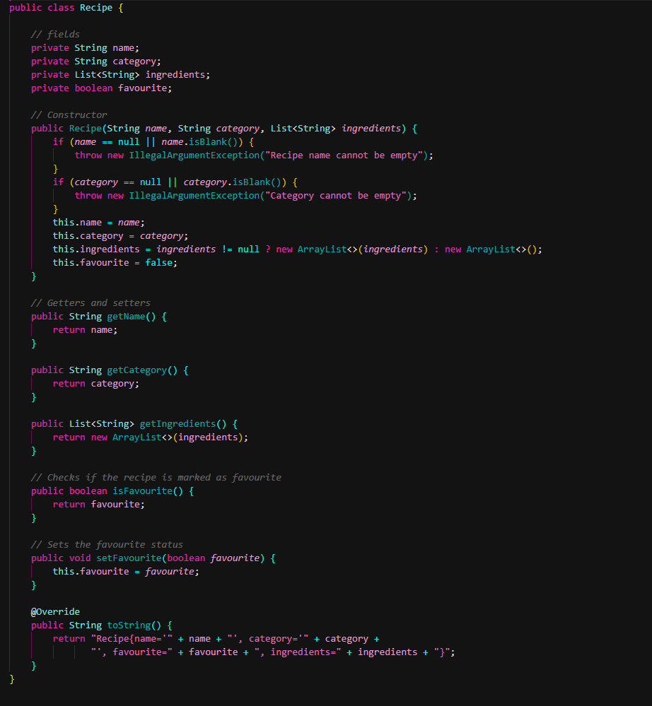
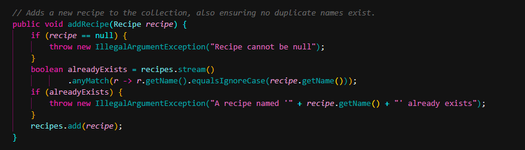
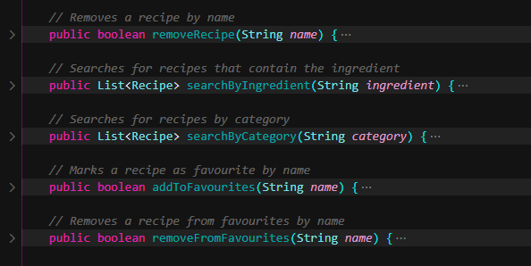

 # Recipe Manager

  A Java console application for managing recipes. Users can add and remove recipes,
  search by ingredient or category, and save favourites.

  ---

  ## What It Does

  The Recipe Manager lets you:
  - Add and remove recipes
  - Search recipes by ingredient (case-insensitive, partial match)
  - Search recipes by category
  - Save recipes as favourites and view your favourites list

  When you run the app it launches a simple menu in the terminal where you pick an
  option by typing a number.

  ## How It Works

  The project is split into three main parts:

  - **`Recipe.java`** — the data model. Holds a recipe's name, category, ingredients
  list, and favourite status
  - **`RecipeManager.java`** — the service layer. Contains all the logic for adding,
  removing, searching, and managing favourites
  - **`Main.java`** — the entry point. Runs the interactive CLI menu

  ---

  ## Clean Code Practices

  ### 1. Single Responsibility Principle
  `Recipe.java` only holds data about a single recipe. It has no knowledge of the
  collection it lives in. All business logic (searching, favouriting, removing) lives
  in `RecipeManager.java`. Each class has one job.

  ```java
  public class Recipe {
      private String name;
      private String category;
      private List<String> ingredients;
      private boolean favourite;
      // only getters, setters, and toString — no business logic
  }
  ```

  ### 2. Guard Clauses (Fail Fast)
  Instead of wrapping logic in nested `if` blocks, `RecipeManager.addRecipe()` throws
  early with a clear error message. This keeps the happy path flat and readable.

  ```java
  public void addRecipe(Recipe recipe) {
      if (recipe == null) {
          throw new IllegalArgumentException("Recipe cannot be null");
      }
      boolean alreadyExists = recipes.stream()
              .anyMatch(r -> r.getName().equalsIgnoreCase(recipe.getName()));
      if (alreadyExists) {
          throw new IllegalArgumentException("A recipe named '" + recipe.getName() +
  "' already exists");
      }
      recipes.add(recipe);
  }
  ```

  ### 3. Descriptive Method Names
  Methods like `searchByIngredient`, `addToFavourites`, and `removeFromFavourites`
  read like plain English. No comments needed to explain what they do — the name says
  it all.

  ```java
  public List<Recipe> searchByIngredient(String ingredient) { ... }
  public boolean addToFavourites(String name) { ... }
  public boolean removeFromFavourites(String name) { ... }
  ```

  ### 4. Defensive Copying
  `Recipe.getIngredients()` returns a copy of the list rather than the original. This
  means outside code can't accidentally modify the recipe's internal data.

  ```java
  public List<String> getIngredients() {
      return new ArrayList<>(ingredients);
  }
  ```

  ---

  ## Test Cases

  All tests are in `RecipeManagerTest.java` and cover both positive and negative
  scenarios.

  | Test | Type | What it checks |
  |---|---|---|
  | `addRecipe_increasesTotalCount` | Positive | Recipe collection grows by 1 when a
  recipe is added |
  | `addRecipe_duplicate_throwsIllegalArgumentException` | Negative | Duplicate recipe
  names are rejected |
  | `addRecipe_null_throwsIllegalArgumentException` | Negative | Null recipes are
  rejected |
  | `removeRecipe_existingName_returnsTrue` | Positive | Existing recipe is removed
  successfully |
  | `removeRecipe_nonExistentName_returnsFalse` | Negative | Removing a recipe that
  doesn't exist returns false |
  | `searchByIngredient_matchingIngredient_returnsCorrectRecipes` | Positive | Correct
  recipes returned for a matching ingredient |
  | `searchByIngredient_noMatch_returnsEmptyList` | Negative | Empty list returned
  when no ingredient matches |
  | `searchByIngredient_blankQuery_returnsEmptyList` | Negative | Blank search input
  returns empty list |
  | `searchByIngredient_isCaseInsensitive` | Positive | Search works regardless of
  uppercase/lowercase |
  | `searchByCategory_matchingCategory_returnsCorrectRecipes` | Positive | Correct
  recipes returned for a matching category |
  | `searchByCategory_noMatch_returnsEmptyList` | Negative | Empty list returned when
  no category matches |
  | `addToFavourites_existingRecipe_marksAsFavourite` | Positive | Recipe is correctly
  marked as favourite |
  | `addToFavourites_nonExistentRecipe_returnsFalse` | Negative | Returns false when
  recipe doesn't exist |
  | `removeFromFavourites_existingFavourite_removesIt` | Positive | Favourite status
  is removed correctly |
  | `getFavourites_noFavourites_returnsEmptyList` | Positive | Empty list returned
  when no favourites saved |

  ---

  ## Dependencies

  All dependencies are managed through Maven and sourced from [Maven
  Central](https://central.sonatype.com/).

  | Dependency | Version | Purpose |
  |---|---|---|
  | `org.junit.jupiter:junit-jupiter` | 5.10.2 | JUnit 5 testing framework |
  | `maven-surefire-plugin` | 3.2.5 | Runs JUnit 5 tests via `mvn test` |

  To download dependencies run:
  ```bash
  mvn dependency:resolve
  ```

  ---

  ## How to Run

  ```bash
  mvn compile exec:java -Dexec.mainClass="Main"
  ```

  ## How to Run Tests

  ```bash
  mvn test
  ```

  ---

  ## GitHub Actions

  The workflow at `.github/workflows/maven.yml` triggers automatically on every push
  to `main` or `dev` and on every pull request targeting `main`. It runs `mvn test` on
  Ubuntu with JDK 17 and reports whether the tests pass or fail.

  ---

  ## Git Workflow

  This project uses a trunk-based development workflow:

  - `main` — stable, production-ready branch
  - `dev` — integration branch where features are merged before going to main
  - Feature branches (e.g. `feature/recipe-model`, `feature/recipe-manager-service`,
  `feature/tests`) are short-lived and merged into `dev` via Pull Requests
  - `dev` is merged into `main` via a final PR once all features are stable

  ---

  ## Problems Encountered

  During the project I ran into a few issues:

  - **Fake annotation files** — `Test.java` and `BeforeEach.java` were accidentally
  created as custom annotations which shadowed JUnit's `@Test` and `@BeforeEach`.
  These were cleared out and the correct JUnit imports were added to the test file.

  - **VSCode red underlines** — even after fixing the pom.xml, VSCode still showed red
  lines on JUnit imports until running `Java: Clean Java Language Server Workspace`
  to force it to re-index the project.

  ---

  ## Examples of Clean code

  Here is a few examples of clean code thats found thought out this project!

    ### 1. Single Responsibility
    

    ### 2. Guard Clauses
    

    ### 3. Descriptive Method Names
    